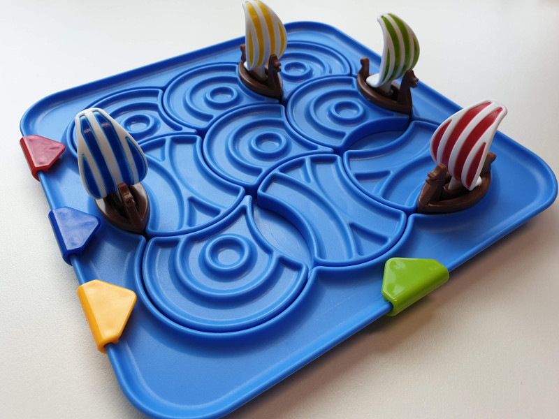
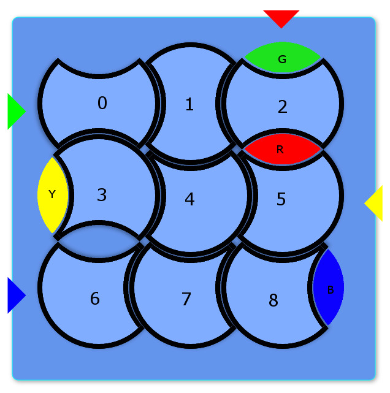
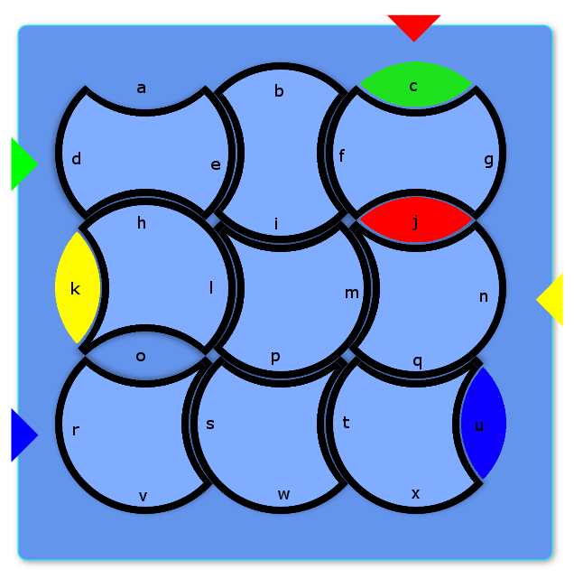

## Overview

Based on a simple children's puzzle called
[Vikings - Brainstorm
](https://www.smartgamesusa.com/vikings?___store=en),
made by [SmartGames](https://www.smartgamesusa.com/), a producer of
educational games.  The design of the game and all of the imagery in
this assignment comes from their Vikings game.

SmartGames have released a [video walkthrough of the the Vikings game](https://www.youtube.com/watch?v=rn6WDGC6lzo).

The game is played by rotating circular tiles representing the sea so as
to move coloured boats to their target placements at the edge of the
board.

## Tiles and Boats

The game comprises nine sea tiles and between one and four boats.
The sea tiles are numbered from the top-left of the board 0-8, and the
boats are labelled by the first letter of their colour, i.e.
* 'B' = blue
* 'G' = green
* 'R' = red
* 'Y' = yellow
The number of each tile and the labels of the boats are shown for an
example game below.

There are two types of tile: 'N' and 'O'. The shape of each type is cut from a full circle:
* An 'N' tile has two lenses removed from it that are next  
to each other and meet at the radius of the circle, like tiles 3-8 in
the image above. There are six 'N' tiles.
* An 'O' tile has two lenses removed on opposing sides of the circle,
like tiles 0-2 in the image above. There are three 'O' tiles.

Each tile can be placed in one of four orientations (0-3).
* For an 'N' tile, orientation 0 has the empty spaces (lenses) at the right and bottom of the tile.
* For an 'O' tile, orientation 0 has the empty spaces at the right and left of the tile.

For all tiles, orientation 1 is a single quarter-turn clockwise from orientation 0;
orientation 2 is a half-turn clockwise from orientation 0; and
orientation 3 is three quarter-turns clockwise from orientation 0.

## Edges

Each neighbouring pair of tiles shares an edge.
The edges are labelled 'a'-'x' from top to bottom and left to right.
The label of each edge is shown for an example game in the image below.

When a tile is rotated, all the boats on its edges move with it.
A tile can only be rotated if there is a boat on at least one of its
edges.
A tile is prevented from rotating if it would be blocked by another tile.
In the example game above, tile 6 is prevented from rotating by
tile 7, because there is no empty space at their shared edge 's'.
However, tile 3 can be rotated because there is a yellow boat at edge 'k'
and a free space at edge 'o' between tiles 3 and 6.
Rotating tile 3 from its current orientation (1) to orientation 2 would
cause the boat at edge 'k' to move to edge 'h', and the free space at edge
'o' to move to 'k'.

## Encoding Board State

The current state of the board at any time is encoded as a board string
of between 20 and 26 characters.
The start of the board string is nine groups of two characters each,
representing the type and orientation of each of the nine tiles in order
of their position.
The remainder of the board string is divided into 1-4 groups of two  
characters each, representing the position of each of the boats in order
'B'-'G'-'R'-'Y'.
The state of the example game in the pictures above would be represented  
by the board string "O1O0O1N1N2N2N3N3N3BuGcRjYk"

## Objective

The goal of the game is to rotate the tiles in sequence so as to
move each boat to its target placement on the edge of the board.
In the example game above, the target placement for each boat is marked  
with a coloured triangle of the same colour.

## Objective Encoding

An objective is specified in terms of two strings:
 - a board string representing the starting position and orientation of each tile and the  
starting position of the boats,
- a string of 2-8 characters representing the target placement for each boat. (An objective may include between one and four boats.)

For example, if the example game above were the starting position, the  
objective would be represented by the strings "O1O0O1N1N2N2N3N3N3BuGcRjYk",  
"BrGdRcYn".